# Quantifying biological and technical variation in amplicon-based microbiome studies
Fan Li  
July 17, 2018  

---

This document describes the analysis corresponding to the manuscript "Quantifying biological and technical variation in amplicon-based microbiome studies" (Bender et al). All figures and analyses presented in the paper are reproduced by the following R code.

***
# Setup
## Get data files
We will start with the sequence variant (SV) table and taxonomy generated using DADA2 and mapping file compiled by hand. These are available [here](data/).


---
## Load packages and data
We will mainly use the `phyloseq` and `vegan` packages for analysis. Let's go ahead and get all the necessary packages loaded. Note that we will also make use of some functions in the `utils.R` script. 


```r
library(ggplot2)
library(ape)
library(plyr)
library(reshape2)
library(cluster)
library(RColorBrewer)
library(phyloseq)
library(grid)
library(gridExtra)
library(gplots)
library(vegan)
library(parallel)
library(useful)
library(pscl)
library(MASS)
library(knitr)
library(stringi)
library(irr)

source("utils.R")

distance_metrics <- c("jsd") # c("bray", "jaccard", "jsd") for additional metrics
alpha_metrics <- c("Chao1", "Shannon", "Simpson", "Observed")
ncores <- 16
```

<br>
Read in SV table, mapping file, and color chart. All of these are available at data/.


```r
out_dir <- "data"
seqtab.nochim <- readRDS(sprintf("%s/merged_seqtab.nochim.rds", out_dir))
mapping_fn <- sprintf("%s/mapping.txt", out_dir)
qpcr_fn <- sprintf("%s/qPCR.txt", out_dir)
blast_fn <- sprintf("%s/BLAST_results.parsed.txt", out_dir)

## load all samples run to first examine controls
mapping <- read.table(mapping_fn, header=T, sep="\t", comment.char="", row.names=1, as.is=T)
sel <- intersect(rownames(mapping), rownames(seqtab.nochim))
mapping <- mapping[sel,]
seqtab.nochim <- seqtab.nochim[sel,]
mapping$NumReadsOTUTable <- rowSums(seqtab.nochim)[rownames(mapping)]
mapping$SampleIDstr <- sprintf("%s (%d)", rownames(mapping), rowSums(seqtab.nochim)[rownames(mapping)])

## load qPCR data
qpcr <- read.table(qpcr_fn, header=T, as.is=T, sep="\t", quote="", comment.char="")
qpcr$OriginalConc <- as.numeric(qpcr$OriginalConc)
qpcr$log10OriginalConc <- log10(qpcr$OriginalConc)
standards <- subset(qpcr, SampleType=="Standard")
mod.pred <- lm(log10OriginalConc ~ Average, standards)
qpcr$CopiesPerUl <- 10^(qpcr$Average*mod.pred$coefficients["Average"] + mod.pred$coefficients["(Intercept)"])
qpcr$log10CopiesPerUl <- log10(qpcr$CopiesPerUl)
sel <- intersect(subset(mapping, Run=="Run051917")$ProjectID, qpcr$Sample)
mapping[match(sel, mapping$ProjectID), "qPCRCopiesPerUl"] <- qpcr[match(sel, qpcr$Sample), "CopiesPerUl"]

# load RDP/BLAST taxa and make phyloseq object
taxa <- read.table(blast_fn, header=F, as.is=T, sep="\t", row.names=1, quote="")
inds_with_taxa <- as.numeric(gsub("seq", "", rownames(taxa))) # some sequences had no BLAST hits, so exclude these from the phyloseq object
seqtab.nochim <- seqtab.nochim[, inds_with_taxa]
blast_taxa <- do.call(rbind, lapply(taxa$V2, function(x) unlist(stri_split_fixed(x, ";"))))
rownames(blast_taxa) <- colnames(seqtab.nochim); colnames(blast_taxa) <- c("Kingdom", "Phylum", "Class", "Order", "Family", "Genus", "Species")
ps <- phyloseq(otu_table(t(seqtab.nochim), taxa_are_rows=TRUE), sample_data(mapping), tax_table(blast_taxa))
set.seed(prod(dim(seqtab.nochim)))

# load color table
color_table <- read.table(sprintf("%s/taxa_coloring.txt", out_dir), header=T, as.is=T, sep="\t", comment.char="")
color_table$Family <- gsub("f__", "", color_table$Family)
coloring <- color_table$Color
names(coloring) <- color_table$Family
ordering <- rev(names(coloring))
cols <- colorRampPalette(c("white", "red"), space = "rgb")
coloring.dilutionfactor <- colorRampPalette(c("black", "white"), space = "rgb")(1001)
coloring.sampletype <- brewer.pal(4, "Set1"); names(coloring.sampletype) <- c("BacterialMock", "Blank", "PCRBlank", "Stool")

ordering.family <- color_table
ordering.family$Class <- factor(ordering.family$Class, levels=unique(ordering.family$Class))
inds=order(ordering.family$Class, ordering.family$Family)
ordering.family <- ordering.family[inds,]
ordering.family$Family <- factor(ordering.family$Family, levels=unique(ordering.family$Family))
```

***
# Evaluate controls and identify contaminant OTUs
## PCoA
First, let's evaluate our positive/negative controls. Are they distinct from the other samples?

```r
ps.relative <- transform_sample_counts(ps, function(x) x / sum(x) )
for (distance_metric in distance_metrics) {
	ordi <- ordinate(ps.relative, method = "PCoA", distance = distance_metric)
	p <- plot_ordination(ps.relative, ordi, "samples", color = "SampleType") + theme_classic() + ggtitle(distance_metric)
	print(p)
}
```

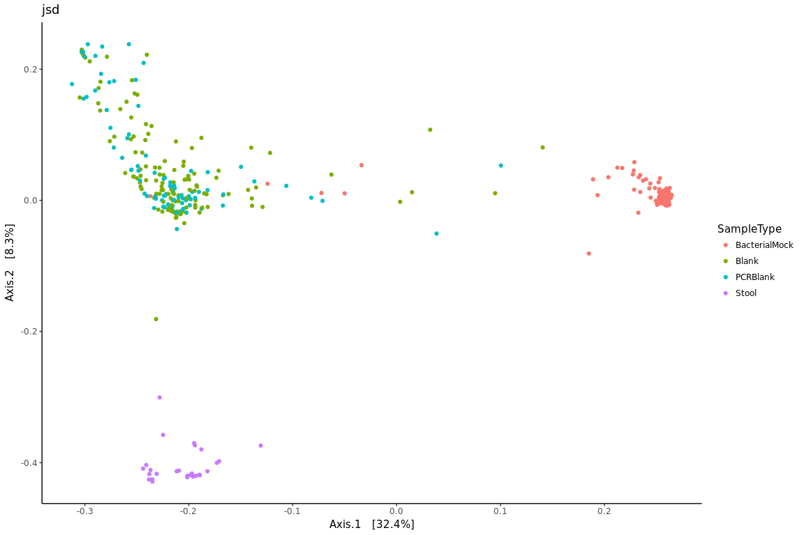
Based on the PCoA plot, the negative controls can be distinguished from the positive (mock) community and our stool samples. Let's further explore the negative controls.

## Negative controls

```r
# remove empty samples
samples_to_remove <- names(which(sample_sums(ps)==0))
ps <- prune_samples(setdiff(sample_names(ps), samples_to_remove), ps)
mapping <- as(sample_data(ps), "data.frame") # leaves 470 samples across 19 runs

# control samples
ps.sel <- subset_samples(ps, SampleType %in% c("Blank", "PCRBlank"))
mapping.sel <- as(sample_data(ps.sel), "data.frame")
otu.filt <- normalizeByCols(as.data.frame(otu_table(ps.sel)))
otu.filt$Family <- getTaxonomy(otus=rownames(otu.filt), tax_tab=tax_table(ps.sel), level="Family")
agg <- aggregate(. ~ Family, otu.filt, sum)
families <- agg$Family
agg <- agg[,-1]
agg <- normalizeByCols(agg)
families[which(rowMeans(agg)<0.01)] <- "Other"
agg$Family <- families
df <- melt(agg, variable.name="SampleID")
df2 <- aggregate(as.formula("value ~ Family + SampleID"), df, sum)
df2$SampleType <- mapping.sel[as.character(df2$SampleID), "SampleType"]
df2$SampleIDstr <- mapping.sel[as.character(df2$SampleID), "SampleIDstr"]
# ordered by NumReadsOTUTable
ordering <- mapping.sel[order(mapping.sel$NumReadsOTUTable, decreasing=T), "SampleIDstr"]
df2$SampleIDstr <- factor(df2$SampleIDstr, levels=ordering)
p <- ggplot(df2, aes_string(x="SampleIDstr", y="value", fill="Family", order="Family")) + geom_bar(stat="identity", position="stack") + ylim(c(-0.1, 1.01)) + theme_classic() + theme(legend.position="right", axis.text.x = element_text(angle=90, vjust=0.5, hjust=1, size=8)) + scale_fill_manual(values=coloring) + ggtitle(sprintf("Negative.Control (ordered by NumReadsOTUTable)")) + guides(col = guide_legend(ncol = 3))
print(p)
```

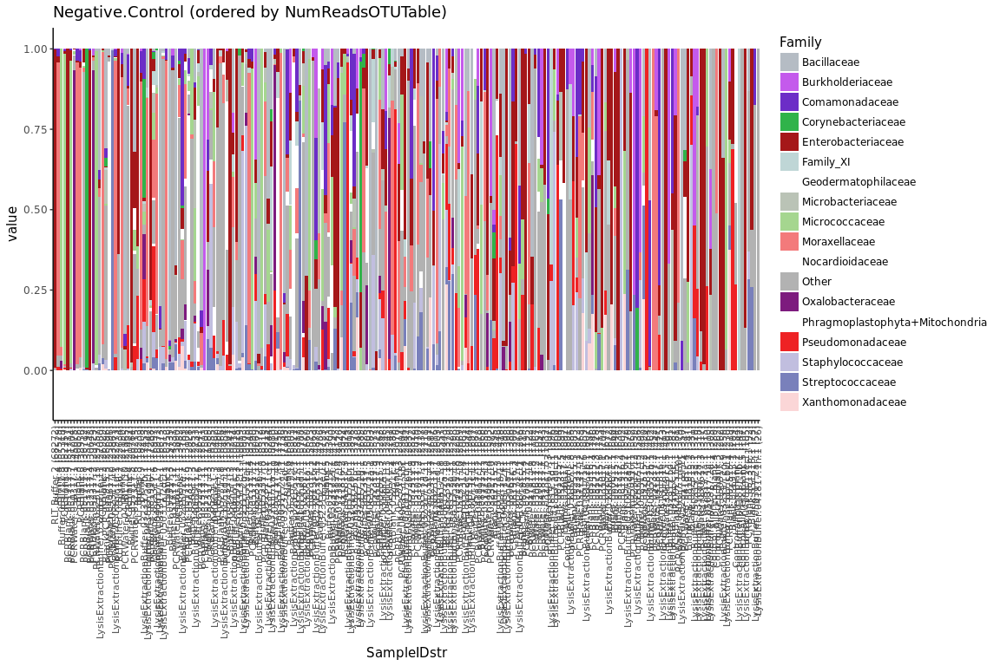
<br><br>
Our negative controls appear to have varied compositions and quite a substantial number of reads. Let's see if we can reduce that by identifying contaminant SVs as those with a majority of their reads derived from negative controls.


## Identify contaminant SVs

```r
# distribution of read counts by blank vs. sample for each SV
otu_table <- as.matrix(as.data.frame(otu_table(ps.sel)))
negids <- rownames(subset(mapping, SampleType %in% c("Blank", "PCRBlank")))
rs <- rowSums(otu_table[,negids])
rs.true <- rowSums(otu_table(ps)[, setdiff(sample_names(ps), negids)])
pct_blank <- 100* (rs / (rs + rs.true))
hist(pct_blank, breaks=100)
```

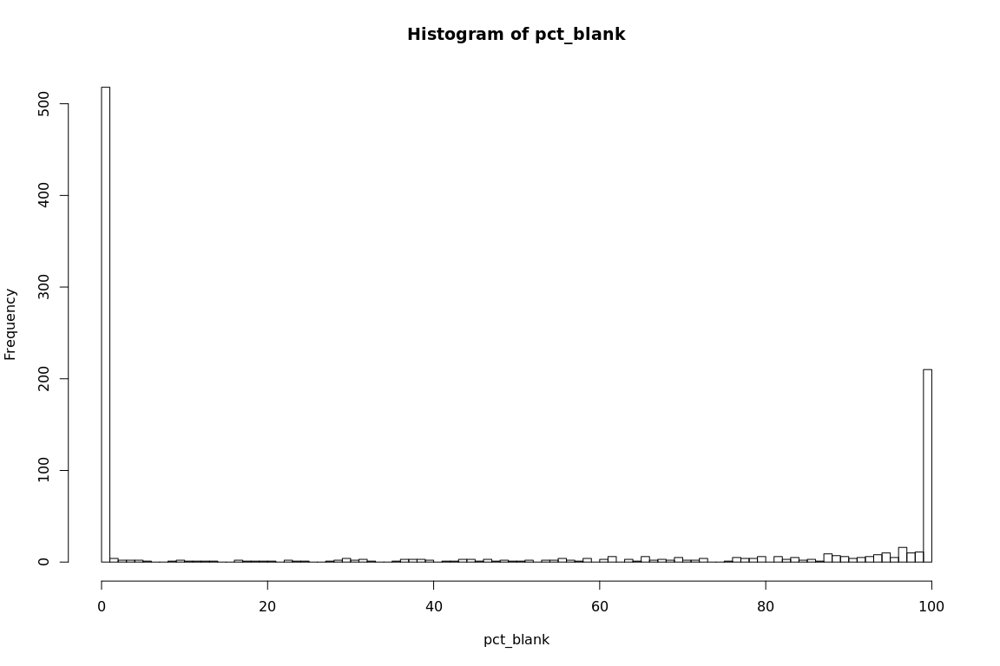

<br><br>
Based on this histogram, we can say that SVs with at least 10% of their reads derived from blanks should be removed. We can then evaluate the number of reads remaining after removing these contaminant SVs from our SV table.

## Remove contaminant SVs

```r
# identify and remove contaminant SVs
otus_to_exclude <- names(which(pct_blank > 10))
# read counts after removing contaminant SVs
ps.unfiltered <- ps
ps <- prune_taxa(setdiff(taxa_names(ps), otus_to_exclude), ps)
df <- melt(sample_sums(ps)); df$SampleID <- rownames(df); df <- df[order(df$value),]; df$SampleID <- factor(df$SampleID, levels=df$SampleID)
df$SampleType <- ifelse(mapping.sel[as.character(df$SampleID), "SampleType"] %in% c("Blank", "PCRBlank"), "Blank", "Sample")
p <- ggplot(df, aes(x=SampleID, y=value, fill=SampleType)) + geom_bar(stat="identity") + theme_classic() + ggtitle("Read counts after contaminant SV removal") + scale_fill_manual(values=c("red", "black"))
print(p)
```

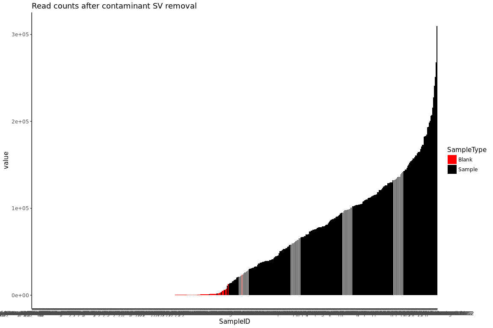
That looks much better. The takeaway here is that we can nicely remove contaminant SVs based on their read count distribution between negative controls and true samples.


***
# Final setup
Now that we have a nice and clean SV table to work from, let's finish getting our analyses set up.

```r
# load metadata coding and typecast as needed
metadata_variables <- read.table(sprintf("%s/metadata_types.txt", out_dir), header=T, as.is=T, sep="\t", row.names=1)
sel <- intersect(rownames(metadata_variables), colnames(mapping))
metadata_variables <- metadata_variables[sel,, drop=F]
mapping.sel <- mapping[rownames(sample_data(ps)), sel]
for (mvar in rownames(metadata_variables)) {
	if (metadata_variables[mvar, "type"] == "factor") {
		mapping.sel[,mvar] <- factor(mapping.sel[,mvar])
		if (!(is.na(metadata_variables[mvar, "baseline"])) && metadata_variables[mvar, "baseline"] != "") {
			mapping.sel[,mvar] <- relevel(mapping.sel[,mvar], metadata_variables[mvar, "baseline"])
		}
	} else if (metadata_variables[mvar, "type"] == "numeric") {
		mapping.sel[,mvar] <- as.numeric(as.character(mapping.sel[,mvar]))
	} else if (metadata_variables[mvar, "type"] == "date") {
		mapping.sel[,mvar] <- as.Date(sprintf("%06d", mapping.sel[,mvar]), format="%m%d%y")
		mapping.sel[,mvar] <- factor(as.character(mapping.sel[,mvar]), levels=as.character(unique(sort(mapping.sel[,mvar]))))
	}
}
sample_data(ps) <- mapping.sel

# rarefy and convert to relative abundance
ps.rarefied <- rarefy_even_depth(ps, sample.size=10942, rngseed=nsamples(ps))
ps <- prune_samples(sample_names(ps.rarefied), ps)
ps.relative <- transform_sample_counts(ps, function(x) x / sum(x) ) # leaves 244 samples across 19 runs
# [Stool1, undiluted BacterialMock] samples
psnonblank <- subset_samples(ps, SampleType %in% c("BacterialMock", "Stool") & DilutionFactor==1)
psnonblank <- subset_samples(psnonblank, !(RunDateString %in% names(which(table(sample_data(psnonblank)$RunDateString)==1))))
psnonblank.relative <- prune_samples(sample_names(psnonblank), ps.relative)
psnonblank.rarefied <- prune_samples(sample_names(psnonblank), ps.rarefied) # leaves 146 samples (29 Stool, 117 BacterialMock) across 19 runs
# BacterialMock (Run051917) only
psmock <- subset_samples(ps, SampleType=="BacterialMock" & RunDateString=="2017-05-19")
psmock.relative <- subset_samples(ps.relative, SampleType=="BacterialMock" & RunDateString=="2017-05-19")
psmock.rarefied <- subset_samples(ps.rarefied, SampleType=="BacterialMock" & RunDateString=="2017-05-19") # leaves 105 samples in a single run
psmockunfiltered <- subset_samples(ps.unfiltered, SampleType=="BacterialMock" & RunDateString=="51917")
sample_data(psmockunfiltered) <- sample_data(psmock)[sample_names(psmockunfiltered),]
psmockunfiltered.relative <- transform_sample_counts(psmockunfiltered, function(x) x / sum(x) )

# compute distance matrices
dm <- list()
dm[["all"]] <- list()
dm[["nonblank"]] <- list()
dm[["mockovertime"]] <- list()
dm[["mock"]] <- list()
for (distance_metric in distance_metrics) {
	dm[["all"]][[distance_metric]] <- as.matrix(distance(ps.relative, method=distance_metric))
	dm[["nonblank"]][[distance_metric]] <- as.matrix(distance(psnonblank.relative, method=distance_metric))
	dm[["mockovertime"]][[distance_metric]] <- as.matrix(distance(subset_samples(psnonblank.relative, SampleType=="BacterialMock"), method=distance_metric))
	dm[["mock"]][[distance_metric]] <- as.matrix(distance(psmock.relative, method=distance_metric))
}

# thresholds for association tests
nsamps_threshold <- 10 # number of reads to call a sample positive
filt_threshold <- 0.1 # fraction of samples that need to be positive to keep an OTU for association testing
nperm <- 100000
```


***
# Does biological variation exceed technical variation?
## PCoA + PERMANOVA
Our first question is whether we can differentiate biological variation from a background of technical variation. To do this, let's first take a broad look at all of our (244) remaining samples after QC filtering.

```r
for (distance_metric in distance_metrics) {
	ordi <- ordinate(ps.relative, method = "PCoA", distance = distance_metric)
	p <- plot_ordination(ps.relative, ordi, "samples", color = "SampleType") + theme_classic() + ggtitle(distance_metric)
	print(p)
}
```

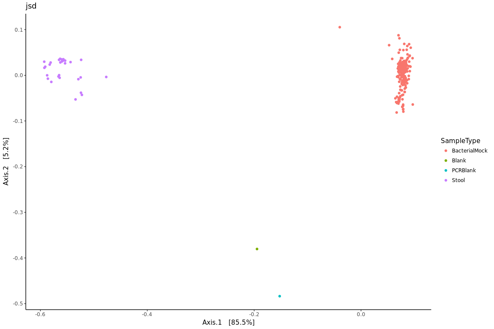


```r
for (distance_metric in distance_metrics) {
	form <- as.formula(sprintf("as.dist(dm[[\"all\"]][[distance_metric]]) ~ %s", paste(rownames(subset(metadata_variables, useForPERMANOVA=="yes")), collapse="+")))
	res <- adonis(form , data=as(sample_data(ps.relative), "data.frame"), permutations=999)
	print(res)
}
```

```
## 
## Call:
## adonis(formula = form, data = as(sample_data(ps.relative), "data.frame"),      permutations = 999) 
## 
## Permutation: free
## Number of permutations: 999
## 
## Terms added sequentially (first to last)
## 
##                  Df SumsOfSqs MeanSqs F.Model      R2 Pr(>F)    
## SampleType        3   10.9397  3.6466 1827.59 0.90088  0.001 ***
## DilutionFactor   10    0.3438  0.0344   17.23 0.02831  0.001 ***
## ExtractionBatch   5    0.0595  0.0119    5.97 0.00490  0.001 ***
## RunDateString    17    0.3854  0.0227   11.36 0.03173  0.001 ***
## Residuals       208    0.4150  0.0020         0.03418           
## Total           243   12.1434                 1.00000           
## ---
## Signif. codes:  0 '***' 0.001 '**' 0.01 '*' 0.05 '.' 0.1 ' ' 1
```
<br><br>
Both the PCoA and PERMANOVA confirm what we already know, namely that the bacterial mock, stool, and negative control samples are very different from one another. To directly address the question of biological versus technical variation, we can examine pairwise distances within replicates of the two stool specimens ('Stool-Within'), between replicates of these stool speciments ('Stool-Between'), and within the bacterial mock community replicates ('Mock-Within').


## Pairwise distances

```r
mapping.sel <- as(sample_data(psnonblank.relative), "data.frame")
mapping.sel$SampleID <- rownames(mapping.sel)
pairs <- ddply(mapping.sel, .(SampleType), function(x) {
	t(combn(x$SampleID, 2))
}); colnames(pairs) <- c("SampleType", "s1", "s2"); pairs$s1 <- as.character(pairs$s1); pairs$s2 <- as.character(pairs$s2)
pairs$WithinRun <- ifelse(mapping.sel[pairs$s1, "RunDateString"]==mapping.sel[pairs$s2, "RunDateString"], "WithinRun", "BetweenRun")
pairs$Group <- factor(paste(pairs$SampleType, pairs$WithinRun, sep="-"))
for (distance_metric in distance_metrics) {
	pairs[, distance_metric] <- dm[["nonblank"]][[distance_metric]][cbind(pairs$s1, pairs$s2)]
	test <- kruskal.test(as.formula(sprintf("%s ~ %s", distance_metric, "Group")), pairs)
	p <- ggplot(pairs, aes_string(x="Group", y=distance_metric)) + geom_boxplot() + theme_classic() + ggtitle(sprintf("%s by %s (%s p=%.4g)", distance_metric, "Group", test$method, test$p.value)) + theme(title=element_text(size=8))
	print(p)
}
```

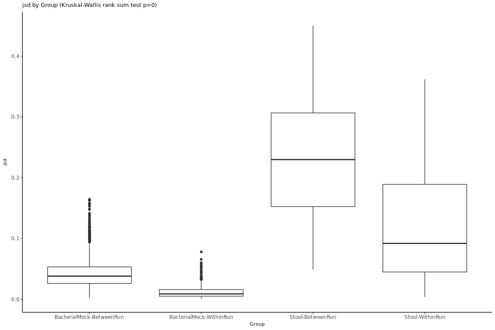
<br><br>
Unsurprisingly, the 'Stool-BetweenRun' distances are significantly greater than the 'Stool-WithinRun' distances; in other words, technical replicates of the same stool specimen are more closely related than biological replicates from the same donor. Interestingly, 'BacterialMock-WithinRun' distances are even smaller than the 'Stool-WithinRun' distances, suggesting that technical variation likely depends on complexity of the community being studied (assumption here is that a real stool community is far more complex than our bacterial mock community).


***
# Technical variation over time
Another major question in this study is how much technical variation is to be expected over the course of a long-term microbiome study. We'll try to answer this question by examining 118 bacterial mock samples that were sequenced in 16 runs over the course of ~2 years.
## Taxonomic composition over time

```r
# BacterialMock taxa barplots over time
ps.sel <- subset_samples(psnonblank.relative, SampleType=="BacterialMock")
ordi <- ordinate(ps.sel, method = "PCoA", distance = "jsd")
ordering.pc1 <- names(sort(ordi$vectors[,"Axis.1"]))
ordering.pc1_run <- unlist(lapply(levels(sample_data(ps.sel)$RunDateString), function(x) intersect(ordering.pc1, rownames(subset(as(sample_data(ps.sel), "data.frame"), RunDateString==x & SampleType=="BacterialMock")))))

otu.filt <- as.data.frame(otu_table(ps.sel))
otu.filt$Family <- getTaxonomy(otus=rownames(otu.filt), tax_tab=tax_table(ps.sel), level="Family")
agg <- aggregate(. ~ Family, otu.filt, sum)
families <- agg$Family
agg <- agg[,-1]
agg <- sweep(agg, 2, colSums(agg), "/")
families[which(rowMeans(agg)<0.01)] <- "Other"
agg$Family <- families
df <- melt(agg, variable.name="SampleID")
agg <- aggregate(value~Family+SampleID, df, sum)
agg$SampleID <- as.character(agg$SampleID)
agg$SampleIDfactor <- factor(agg$SampleID, levels=ordering.pc1_run)
agg$Family <- factor(agg$Family, levels=levels(ordering.family$Family))
agg$SampleIDfactor <- factor(agg$SampleID, levels=ordering.pc1_run)
p <- ggplot(agg, aes(x=SampleIDfactor, y=value, fill=Family, order=Family)) + geom_bar(stat="identity", position="stack") + theme_classic() + theme(legend.position="right", axis.text.x = element_text(angle=90, vjust=0.5, hjust=1, size=4)) + ggtitle(sprintf("%s taxa summary (L5, ordered by Run+PC1, contam filtered)", "BacterialMock")) + scale_fill_manual(values=coloring) + ylim(c(-.1, 1.01))
print(p)
```

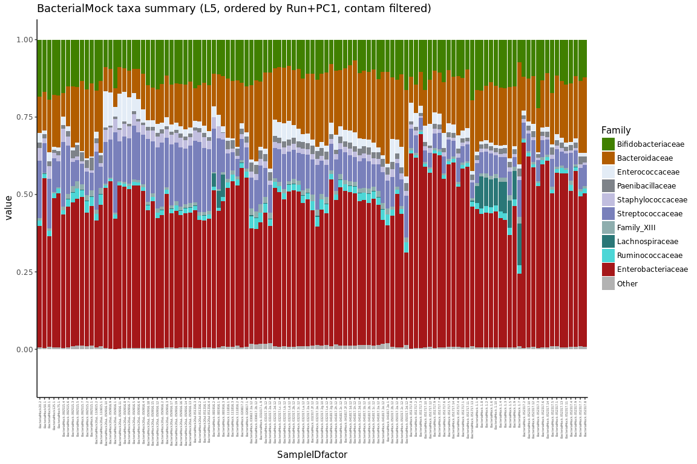


```r
for (distance_metric in distance_metrics) {
	print(distance_metric)
	form <- as.formula(sprintf("as.dist(dm[[\"mockovertime\"]][[distance_metric]]) ~ RunDateString"))
	res <- adonis(form , data=as(sample_data(ps.sel), "data.frame"), permutations=999)
	print(res)
}
```

```
## [1] "jsd"
## 
## Call:
## adonis(formula = form, data = as(sample_data(ps.sel), "data.frame"),      permutations = 999) 
## 
## Permutation: free
## Number of permutations: 999
## 
## Terms added sequentially (first to last)
## 
##                Df SumsOfSqs   MeanSqs F.Model      R2 Pr(>F)    
## RunDateString  15  0.100803 0.0067202  47.222 0.87521  0.001 ***
## Residuals     101  0.014373 0.0001423         0.12479           
## Total         116  0.115177                   1.00000           
## ---
## Signif. codes:  0 '***' 0.001 '**' 0.01 '*' 0.05 '.' 0.1 ' ' 1
```
<br><br>
Even though the PERMANOVA suggests that there is a very strong `RunDateString` effect, this is likely due to the inclusion of only a set of very closely related samples. The taxa barplots tell us that the composition is generally consistent, although perhaps not as identical as one might like. Let's try to quantify this consistency by looking at pairwise distances and intraclass correlation (ICC). 

## Pairwise distances and intraclass correlation (ICC)

```r
mapping.sel <- as(sample_data(psnonblank.relative), "data.frame")
mapping.sel$SampleID <- rownames(mapping.sel)
pairs <- ddply(mapping.sel, .(SampleType), function(x) {
	t(combn(x$SampleID, 2))
}); colnames(pairs) <- c("SampleType", "s1", "s2"); pairs$s1 <- as.character(pairs$s1); pairs$s2 <- as.character(pairs$s2)
pairs$WithinRun <- ifelse(mapping.sel[pairs$s1, "RunDateString"]==mapping.sel[pairs$s2, "RunDateString"], "WithinRun", "BetweenRun")
pairs$Group <- factor(paste(pairs$SampleType, pairs$WithinRun, sep="-"))
pairs$Run <- mapping.sel[pairs$s1, "RunDateString"]
for (distance_metric in distance_metrics) {
	pairs[, distance_metric] <- dm[["nonblank"]][[distance_metric]][cbind(pairs$s1, pairs$s2)]
}
pairs.within <- subset(pairs, WithinRun=="WithinRun")
pairs.within.mock <- subset(pairs.within, SampleType=="BacterialMock")
pairs.mock <- subset(pairs, SampleType=="BacterialMock"); levels(pairs.mock$Run) <- c(levels(pairs.mock$Run), "Inter"); pairs.mock$Run[which(pairs.mock$WithinRun!="WithinRun")] <- "Inter"
for (distance_metric in distance_metrics) {
	test.stool <- kruskal.test(as.formula(sprintf("%s ~ %s", distance_metric, "Run")), subset(pairs.within, SampleType=="Stool"))
	test.mock <- kruskal.test(as.formula(sprintf("%s ~ %s", distance_metric, "Run")), subset(pairs.within, SampleType=="BacterialMock"))
	p <- ggplot(pairs.mock, aes_string(x="Run", y=distance_metric, fill="SampleType")) + geom_boxplot() + theme_classic() + ggtitle(sprintf("%s by %s (%s %.4g for BacterialMock, mean=%.4g)", distance_metric, "Run", test.mock$method, test.mock$p.value, mean(pairs.within.mock[, distance_metric]))) + theme(title=element_text(size=8)) + scale_fill_brewer(palette="Set1")
	print(p)
}
```


```r
res <- {}
ps.sel <- subset_samples(psnonblank.relative, SampleType=="BacterialMock")
for (taxlevel in c("Family", "Genus", "Species", "SV")) {
	mapping.sel <- as(sample_data(ps.sel), "data.frame")
	otu.filt <- as.data.frame(otu_table(ps.sel))
	otu.filt$tax <- getTaxonomy(otus=rownames(otu.filt), tax_tab=tax_table(ps.sel), level=taxlevel)
	agg <- aggregate(. ~ tax, otu.filt, sum)
	agg <- subset(agg, !(tax %in% c("", "uncultured")))
	tax <- agg$tax
	agg <- agg[,-1]
	rownames(agg) <- tax
	agg <- agg[setdiff(1:nrow(agg), which(rowMeans(agg)<0.001)),] # dont test taxa with <0.1% mean rel. abund.
	agg <- normalizeByCols(agg)
	# ICC
	df <- data.frame(ICC=unlist(lapply(levels(mapping.sel$RunDateString), function(lvl) {
		tmp <- agg[,rownames(subset(mapping.sel, RunDateString==lvl))]
		icc(tmp)$value
	})), RunDateString=factor(levels(mapping.sel$RunDateString), levels=levels(mapping.sel$RunDateString)), taxlevel=taxlevel)
	res <- rbind(res, df)
	# ICC across all runs
	df <- data.frame(ICC=icc(agg)$value, RunDateString="all", taxlevel=taxlevel)
	res <- rbind(res, df)
}
p <- ggplot(res, aes(x=RunDateString, y=ICC, color=taxlevel, group=taxlevel)) + geom_line() + geom_point() + theme_classic() + ggtitle("ICC by RunDateString") + ylim(c(0.8,1))
print(p)
```

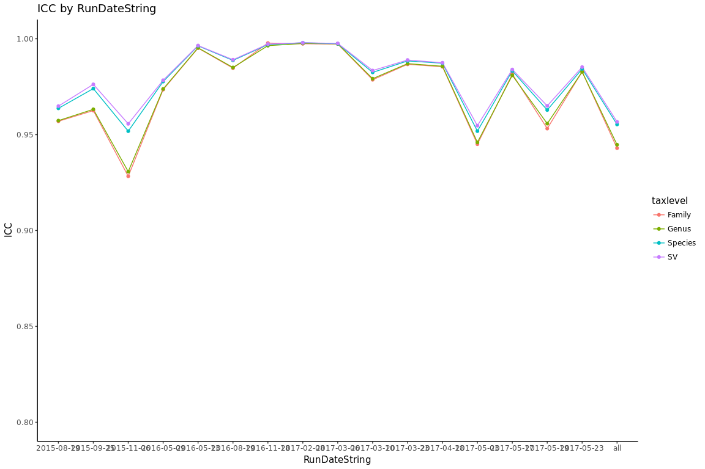

<br><br>
This gives us an idea of how much run-to-run variation we can expect, measured both by beta diversity (Jenson-Shannon divergence) and by intraclass correlation. One caveat to these numbers is that they are a summary over all the bacterial members present in each sample. One might expect that variation may differ from one bacterial taxon to another, especially if they are more or less abundant. Let's investigate this effect:

## Coefficient of variation (CV)

```r
overall_res <- {}
for (taxlevel in c("Family", "Genus", "Species", "SV")) {
	mapping.sel <- as(sample_data(ps.sel), "data.frame")
	otu.filt <- as.data.frame(otu_table(ps.sel))
	otu.filt$tax <- getTaxonomy(otus=rownames(otu.filt), tax_tab=tax_table(ps.sel), level=taxlevel)
	agg <- aggregate(. ~ tax, otu.filt, sum)
	agg <- subset(agg, !(tax %in% c("", "uncultured")))
	tax <- agg$tax
	agg <- agg[,-1]
	rownames(agg) <- tax
	agg <- agg[setdiff(1:nrow(agg), which(rowMeans(agg)<0.001)),] # dont test taxa with <0.1% mean rel. abund.
	agg <- normalizeByCols(agg, 100)
	df <- t(do.call(rbind, lapply(levels(mapping.sel$RunDateString), function(lvl) {
		tmp <- agg[,rownames(subset(mapping.sel, RunDateString==lvl))]
		apply(tmp, 1, function(x) sd(x)/mean(x))
	})))
	colnames(df) <- levels(mapping.sel$RunDateString)
	mra <- sort(rowMeans(agg[rownames(df),]), decreasing=T)
	df <- df[names(mra),]
	mra.coloring <- 1-mra; mra.coloring <- (mra.coloring - min(mra.coloring)) / (max(mra.coloring) - min(mra.coloring))
	mra.coloring <- rgb(matrix(rep(mra.coloring, each=3), ncol=3, byrow=T))
	overall_var <- apply(agg, 1, function(x) sd(x)/mean(x))[names(mra)]
	overall_res <- rbind(overall_res, data.frame(MRA=mra, var=overall_var, taxlevel=taxlevel))
	rowlabels <- sprintf("%s (mean rel abund=%.4g, overall CV=%.4g)", strtrim(rownames(df), 20), mra, overall_var)
	df2 <- cbind(overall_var, df); colnames(df2)[1] <- "interassay_CV"
	df2.short <- round(df2, digits=3)
	heatmap.2(df2, Colv=F, Rowv=F, dendrogram="none", col = cols, trace="none", margin=c(10, 20), cexCol=1.0, cexRow=0.6, labRow=rowlabels, adjRow=c(0,NA), density.info="none", key.xlab="CV", RowSideColors=mra.coloring, keysize=1, main=sprintf("CV heatmap - %s", taxlevel), scale="none", breaks=seq(from=0,to=5,by=0.1))
	heatmap.2(df2, Colv=F, Rowv=F, dendrogram="none", col = cols, trace="none", margin=c(10, 20), cexCol=1.0, cexRow=0.6, labRow=rowlabels, adjRow=c(0,NA), density.info="none", key.xlab="CV", RowSideColors=mra.coloring, keysize=1, cellnote=df2.short, notecex=0.6, notecol="black", main=sprintf("CV heatmap - %s", taxlevel), scale="none", breaks=seq(from=0,to=5,by=0.1))
	write.table(df, file=sprintf("/Lab_Share/Dilution_Study/phyloseq/taxa_specific_CV_by_Run.%s.txt", taxlevel), quote=F, sep="\t", row.names=T, col.names=T)
}
```

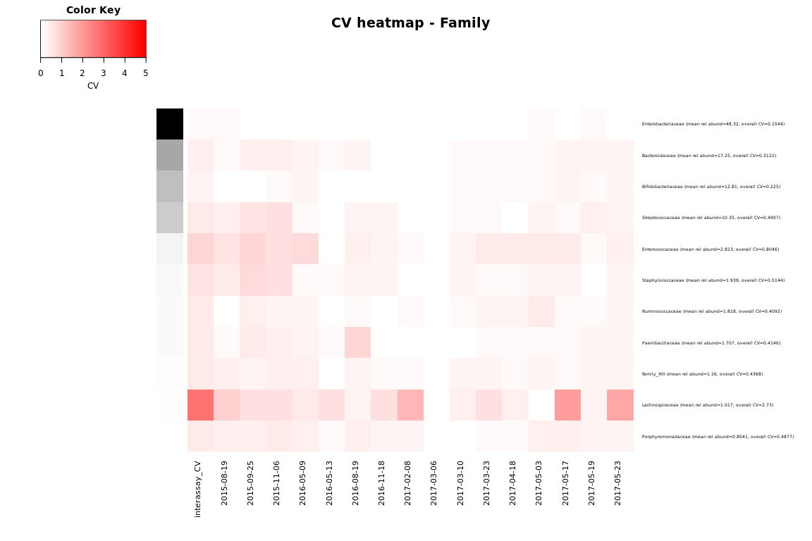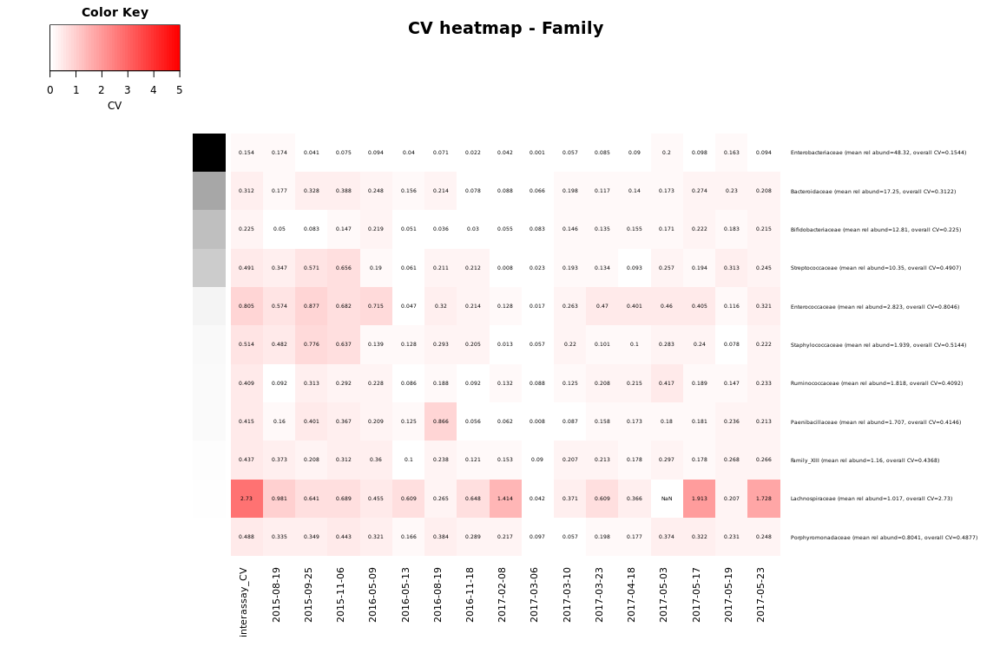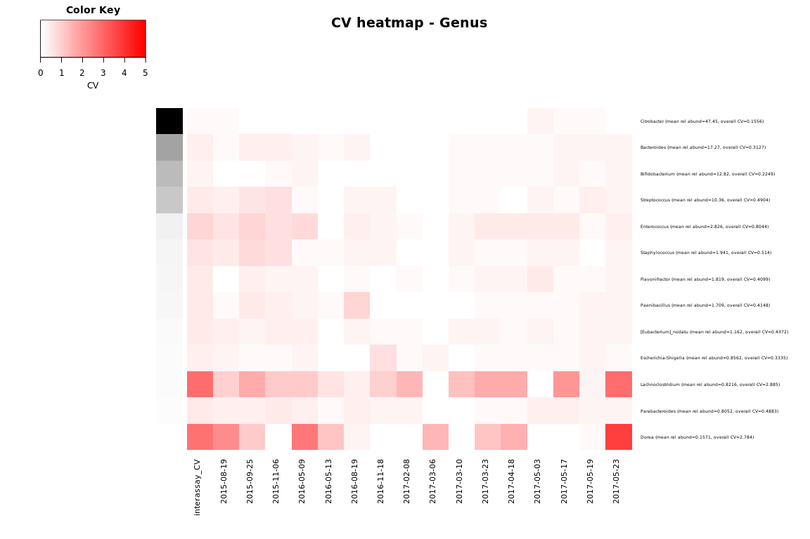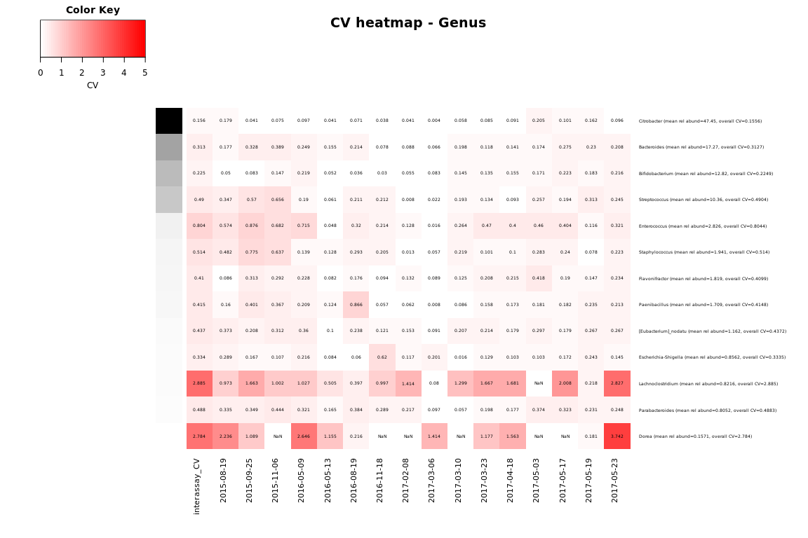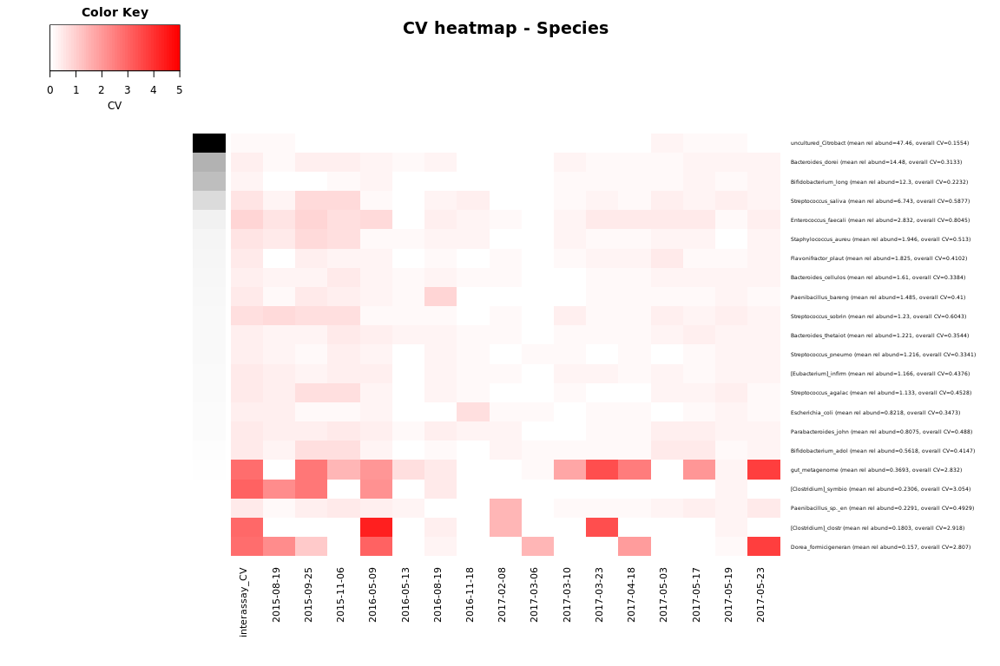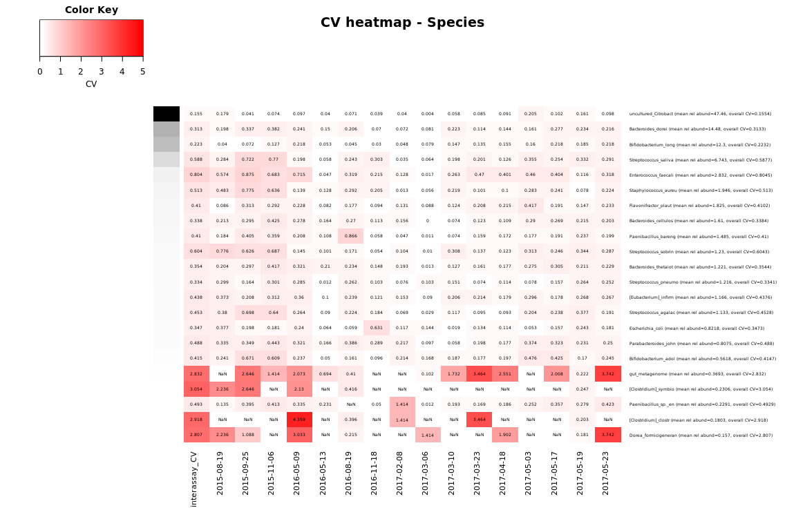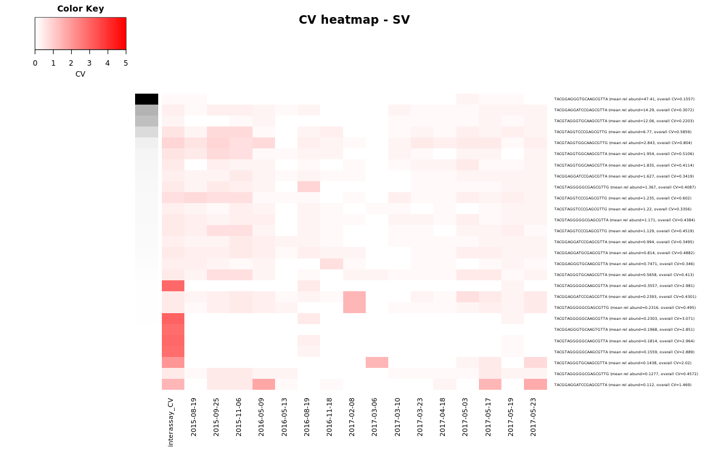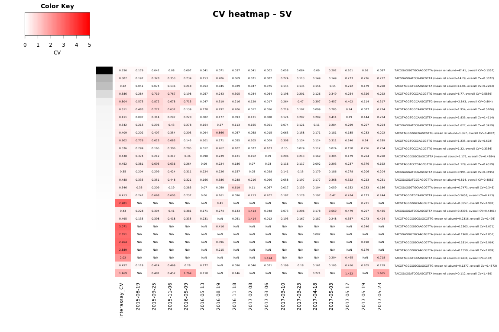

Unsurprisingly, rarer taxa appear to be more variable. It's also worth noting that *Bifidobacterium* appears to be less variable than expected, and that *Streptococcus/Enterococcus/Staphylococcus* form a module of increased variability (at least in a subset of the sequencing runs). 

***
# How does input biomass affect variation?
In this section, we'll examine the effect of input biomass on microbiome variation. To do this, we constructed a dilution series from the bacterial mock community used in the previous section. The dilution series comprised 11 concentrations - [stock, 1:10, 1:20, 1:30, 1:40, 1:50, 1:60, 1:80, 1:100, 1:500, and 1:1000], each of which was done in ten replicates. We used 16S qPCR to quantify the absolute 16S copy number in terms of copies/uL and characterized the microbial composition using 16S rRNA sequencing.

## qPCR measurements versus expected dilution constants
First, let's examine our qPCR data and check that it matches the expected dilution constants. 

```r
ps.sel <- psmock.relative
mapping.sel <- as(sample_data(ps.sel), "data.frame")
mapping.sel$log10CopiesPerUl <- log10(mapping.sel$qPCRCopiesPerUl)
agg <- aggregate(log10CopiesPerUl ~ DilutionFactor, mapping.sel, mean)
agg$ExpectedLog10CopiesPerUl <- agg$log10CopiesPerUl[1] - log10(as.numeric(as.character(agg$DilutionFactor)))
agg$ExpectedLog10CopiesPerUlRecal <- c(agg$ExpectedLog10CopiesPerUl[1], agg$log10CopiesPerUl[2] - log10(as.numeric(as.character(agg$DilutionFactor[2:11]))) + 1) # recalibrated from the 1:10 dilution
qpcr.agg <- agg # store for later use
mapping.sel$ExpectedLog10CopiesPerUl <- qpcr.agg[match(mapping.sel$DilutionFactor, qpcr.agg$DilutionFactor), "ExpectedLog10CopiesPerUl"]
mapping.sel$ExpectedLog10CopiesPerUlRecal <- qpcr.agg[match(mapping.sel$DilutionFactor, qpcr.agg$DilutionFactor), "ExpectedLog10CopiesPerUlRecal"]
test <- cor.test(~log10CopiesPerUl + ExpectedLog10CopiesPerUlRecal, data=qpcr.agg, method="pearson")
p <- ggplot(mapping.sel, aes(x=ExpectedLog10CopiesPerUlRecal, y=log10CopiesPerUl)) + geom_point() + stat_smooth(method="lm") + theme_classic() + ggtitle(sprintf("Expected vs qPCR log10CopiesPerUl (Recal; Pearson r=%.4g, p=%.4g)", test$estimate, test$p.value))
print(p)
```


```r
p <- ggplot(mapping.sel, aes(x=DilutionFactor, y=log10CopiesPerUl)) + geom_boxplot() + theme_classic() + ggtitle(sprintf("qPCR quant by DilutionFactor (Pearson r=%.4g, p=%.4g)", test$estimate, test$p.value)) + geom_point(data=agg, aes(x=DilutionFactor, y=ExpectedLog10CopiesPerUl, color="ExpectedLog10Copies"), inherit.aes=F) + geom_point(data=agg, aes(x=DilutionFactor, y=ExpectedLog10CopiesPerUlRecal, color="ExpectedLog10CopiesRecal"), inherit.aes=F)
print(p)
```

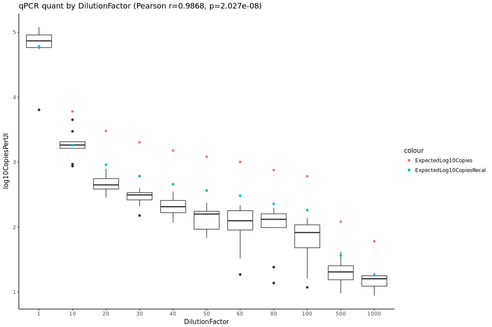
<br><br>
We see the expected strong correlation between theoretical and measured concentrations (Pearson r=0.986766). However, we also see some bias, as the measured values are monotonically lower than the expected values.

## Taxonomic composition
Next, let's look at the microbiome data. Here is the taxa barplot prior to the contamination filtering step:

```r
ps.sel <- psmockunfiltered.relative
ordi <- ordinate(ps.sel, method = "PCoA", distance = "jsd")
ordering.pc1 <- names(sort(ordi$vectors[,"Axis.1"]))
ordering.pc1_dilutionfactor <- unlist(lapply(levels(sample_data(ps.sel)$DilutionFactor), function(x) intersect(ordering.pc1, rownames(subset(sample_data(ps.sel), DilutionFactor==x & SampleType=="BacterialMock")))))
otu.filt <- as.data.frame(otu_table(ps.sel))
otu.filt$Family <- getTaxonomy(otus=rownames(otu.filt), tax_tab=tax_table(ps.sel), level="Family")
agg <- aggregate(. ~ Family, otu.filt, sum)
families <- agg$Family
agg <- agg[,-1]
agg <- sweep(agg, 2, colSums(agg), "/")
families[which(rowMeans(agg)<0.01)] <- "Other"
agg$Family <- families
df <- melt(agg, variable.name="SampleID")
agg <- aggregate(value~Family+SampleID, df, sum)
agg$SampleID <- as.character(agg$SampleID)
agg$SampleIDfactor <- droplevels(factor(agg$SampleID, levels=ordering.pc1_dilutionfactor))
agg$Family <- factor(agg$Family, levels=levels(ordering.family$Family))
# taxa barplot representation
df.SampleIDstr <- unique(agg[,c("SampleID", "SampleIDfactor")])
df.SampleIDstr$DilutionFactor <- as.character(mapping[df.SampleIDstr$SampleID, "DilutionFactor"])
p <- ggplot(agg, aes(x=SampleIDfactor, y=value, fill=Family, order=Family)) + geom_bar(stat="identity", position="stack") + theme_classic() + theme(legend.position="right", axis.text.x = element_text(angle=90, vjust=0.5, hjust=1, size=4)) + ggtitle(sprintf("%s taxa summary (L5, ordered by DilutionFactor+PC1)", "BacterialMock 051917")) + scale_fill_manual(values=coloring) + ylim(c(-.1, 1.01)) + annotate("rect", xmin = as.numeric(df.SampleIDstr$SampleIDfactor)-0.5, xmax = as.numeric(df.SampleIDstr$SampleIDfactor)+0.5, ymin = -0.04, ymax = -0.02, fill=coloring.dilutionfactor[as.numeric(df.SampleIDstr$DilutionFactor)+1])
print(p)
```

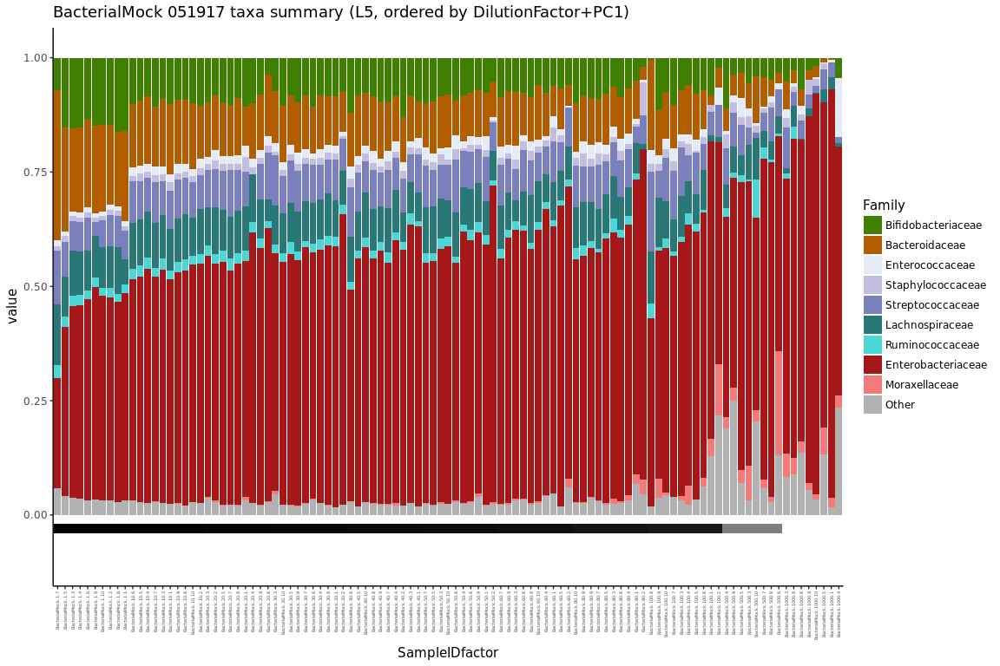

We can see that there is some contamination (e.g. Moraxellaceae) that starts to appear in the more dilute mocks. Here is the taxa barplot after the contamination filtering step:

```r
ps.sel <- psmock.relative
ordi <- ordinate(ps.sel, method = "PCoA", distance = "jsd")
ordering.pc1 <- names(sort(ordi$vectors[,"Axis.1"]))
ordering.pc1_dilutionfactor <- unlist(lapply(levels(sample_data(ps.sel)$DilutionFactor), function(x) intersect(ordering.pc1, rownames(subset(sample_data(ps.sel), DilutionFactor==x & SampleType=="BacterialMock")))))
otu.filt <- as.data.frame(otu_table(ps.sel))
otu.filt$Family <- getTaxonomy(otus=rownames(otu.filt), tax_tab=tax_table(ps.sel), level="Family")
agg <- aggregate(. ~ Family, otu.filt, sum)
families <- agg$Family
agg <- agg[,-1]
agg <- sweep(agg, 2, colSums(agg), "/")
families[which(rowMeans(agg)<0.01)] <- "Other"
agg$Family <- families
df <- melt(agg, variable.name="SampleID")
agg <- aggregate(value~Family+SampleID, df, sum)
agg$SampleID <- as.character(agg$SampleID)
agg$SampleIDfactor <- droplevels(factor(agg$SampleID, levels=ordering.pc1_dilutionfactor))
agg$Family <- factor(agg$Family, levels=levels(ordering.family$Family))
# taxa barplot representation
df.SampleIDstr <- unique(agg[,c("SampleID", "SampleIDfactor")])
df.SampleIDstr$DilutionFactor <- as.character(mapping[df.SampleIDstr$SampleID, "DilutionFactor"])
p <- ggplot(agg, aes(x=SampleIDfactor, y=value, fill=Family, order=Family)) + geom_bar(stat="identity", position="stack") + theme_classic() + theme(legend.position="right", axis.text.x = element_text(angle=90, vjust=0.5, hjust=1, size=4)) + ggtitle(sprintf("%s taxa summary (L5, ordered by DilutionFactor+PC1, contam filtered)", "BacterialMock 051917")) + scale_fill_manual(values=coloring) + ylim(c(-.1, 1.01)) + annotate("rect", xmin = as.numeric(df.SampleIDstr$SampleIDfactor)-0.5, xmax = as.numeric(df.SampleIDstr$SampleIDfactor)+0.5, ymin = -0.04, ymax = -0.02, fill=coloring.dilutionfactor[as.numeric(df.SampleIDstr$DilutionFactor)+1])
print(p)
```

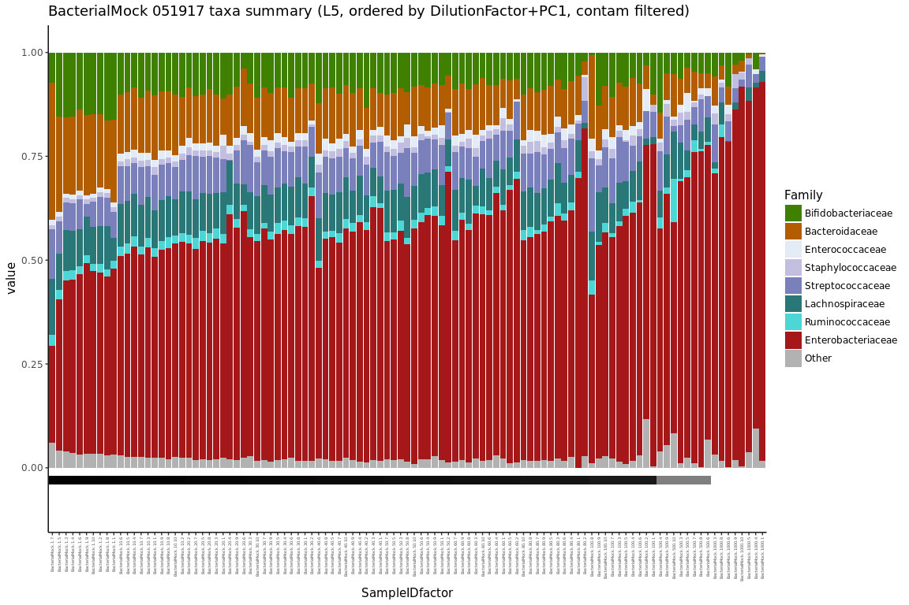

Excellent! Looks like we've been able to filter out the sequences that are likely contributed by lab reagents. Now let's examine how variation changes with the dilution coefficient. We'll start off by looking at pairwise (beta) distances:

## Pairwise distances as a function of dilution constant

```r
pairs <- as.data.frame(do.call(rbind, lapply(levels(mapping.sel$DilutionFactor), function(lvl) cbind(t(combn(rownames(subset(mapping.sel, DilutionFactor==lvl)), 2)), lvl) )))
colnames(pairs) <- c("s1", "s2", "DilutionFactor")
pairs$DilutionFactor <- factor(pairs$DilutionFactor, levels=levels(mapping.sel$DilutionFactor))
for (distance_metric in distance_metrics) {
	pairs[, distance_metric] <- dm[["mock"]][[distance_metric]][cbind(as.character(pairs$s1), as.character(pairs$s2))]
	test <- kruskal.test(as.formula(sprintf("%s ~ %s", distance_metric, "DilutionFactor")), pairs)
	p <- ggplot(pairs, aes_string(x="DilutionFactor", y=distance_metric)) + geom_boxplot() + theme_classic() + ggtitle(sprintf("%s by %s (%s p=%.4g)", distance_metric, "DilutionFactor", test$method, test$p.value)) + theme(title=element_text(size=8))
	print(p)
}
```

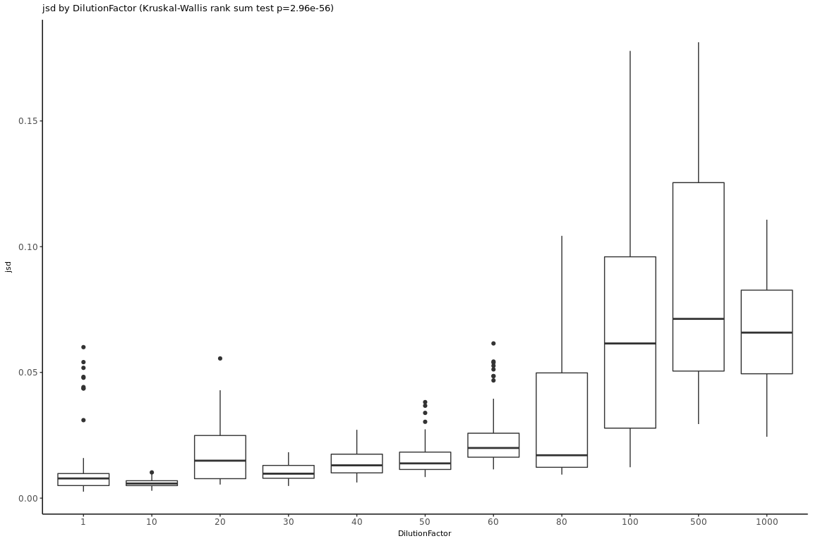
As expected, distances increase with more dilute samples. Remember previously that we observed technical variation from two biological samples to be ~0.10 and biological variation between two specimens to be ~0.17. We see here that the 1:100, 1:500, and 1:1000 dilutions here seem to approach those distances. Now let's look at intraclass correlation (ICC) and coefficient of variation (CV) values:


## Intraclass correlation (ICC) and coefficient of variation (CV)

```r
res <- {}
for (taxlevel in c("Family", "Genus", "Species", "SV")) {
	mapping.sel <- as(sample_data(psmock.relative), "data.frame")
	otu.filt <- as.data.frame(otu_table(psmock.relative))
	otu.filt$tax <- getTaxonomy(otus=rownames(otu.filt), tax_tab=tax_table(psmock.relative), level=taxlevel)
	agg <- aggregate(. ~ tax, otu.filt, sum)
	agg <- subset(agg, !(tax %in% c("", "uncultured")))
	tax <- agg$tax
	agg <- agg[,-1]
	rownames(agg) <- tax
	agg <- agg[setdiff(1:nrow(agg), which(rowMeans(agg)<0.001)),] # dont test taxa with <0.1% mean rel. abund.
	agg <- normalizeByCols(agg)
	# ICC
	df <- data.frame(ICC=unlist(lapply(levels(mapping.sel$DilutionFactor), function(lvl) {
		tmp <- agg[,rownames(subset(mapping.sel, DilutionFactor==lvl))]
		icc(tmp)$value
	})), DilutionFactor=factor(levels(mapping.sel$DilutionFactor), levels=levels(mapping.sel$DilutionFactor)), taxlevel=taxlevel)
	res <- rbind(res, df)
}
p <- ggplot(res, aes(x=DilutionFactor, y=ICC, color=taxlevel, group=taxlevel)) + geom_line() + geom_point() + theme_classic() + ggtitle("ICC by DilutionFactor") + ylim(c(0.9,1))
print(p)
```

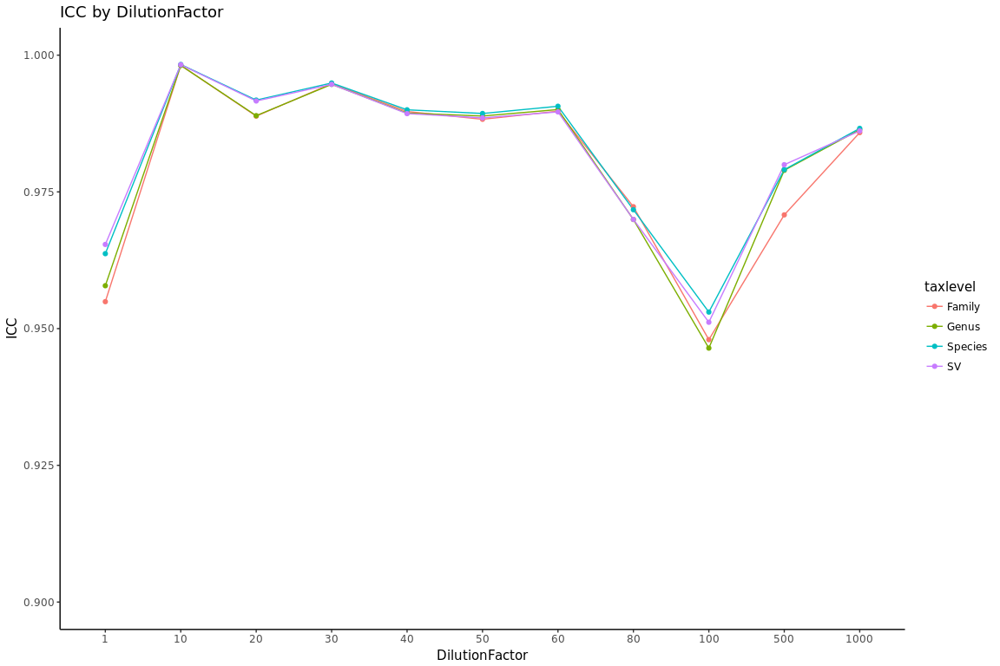


```r
for (taxlevel in c("Family", "Genus", "Species", "SV")) {
	mapping.sel <- as(sample_data(psmock.relative), "data.frame")
	otu.filt <- as.data.frame(otu_table(psmock.relative))
	otu.filt$tax <- getTaxonomy(otus=rownames(otu.filt), tax_tab=tax_table(psmock.relative), level=taxlevel)
	agg <- aggregate(. ~ tax, otu.filt, sum)
	agg <- subset(agg, !(tax %in% c("", "uncultured")))
	tax <- agg$tax
	agg <- agg[,-1]
	rownames(agg) <- tax
	agg <- agg[setdiff(1:nrow(agg), which(rowMeans(agg)<0.001)),] # dont test taxa with <0.1% mean rel. abund.
	agg <- normalizeByCols(agg) * 100 # convert to percentages
	df <- t(do.call(rbind, lapply(levels(mapping.sel$DilutionFactor), function(lvl) {
		tmp <- agg[,rownames(subset(mapping.sel, DilutionFactor==lvl))]
		apply(tmp, 1, function(x) sd(x)/mean(x))
	})))
	colnames(df) <- levels(mapping.sel$DilutionFactor)
	mra <- sort(rowMeans(agg[rownames(df),]), decreasing=T)
	df <- df[names(mra),]
	mra.coloring <- 1-mra; mra.coloring <- (mra.coloring - min(mra.coloring)) / (max(mra.coloring) - min(mra.coloring))
	mra.coloring <- rgb(matrix(rep(mra.coloring, each=3), ncol=3, byrow=T))
	rowlabels <- sprintf("%s (mean rel abund=%.4g)", rownames(df), mra)
	heatmap.2(df, Colv=F, Rowv=F, dendrogram="none", col = cols, trace="none", margin=c(10, 20), cexCol=1.0, cexRow=0.6, labRow=rowlabels, adjRow=c(0,NA), density.info="none", key.xlab="CV", RowSideColors=mra.coloring, keysize=1, main=sprintf("CV heatmap - %s", taxlevel))
}
```

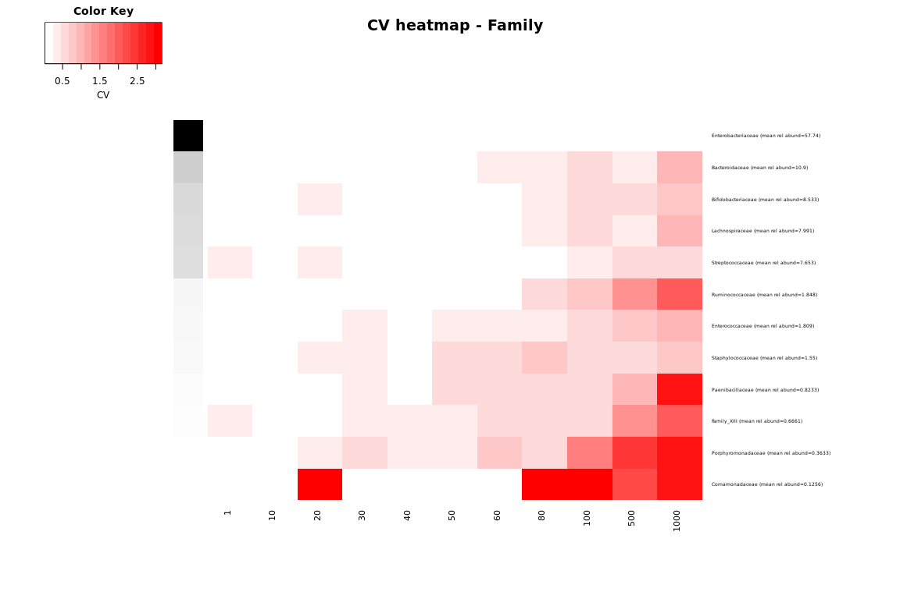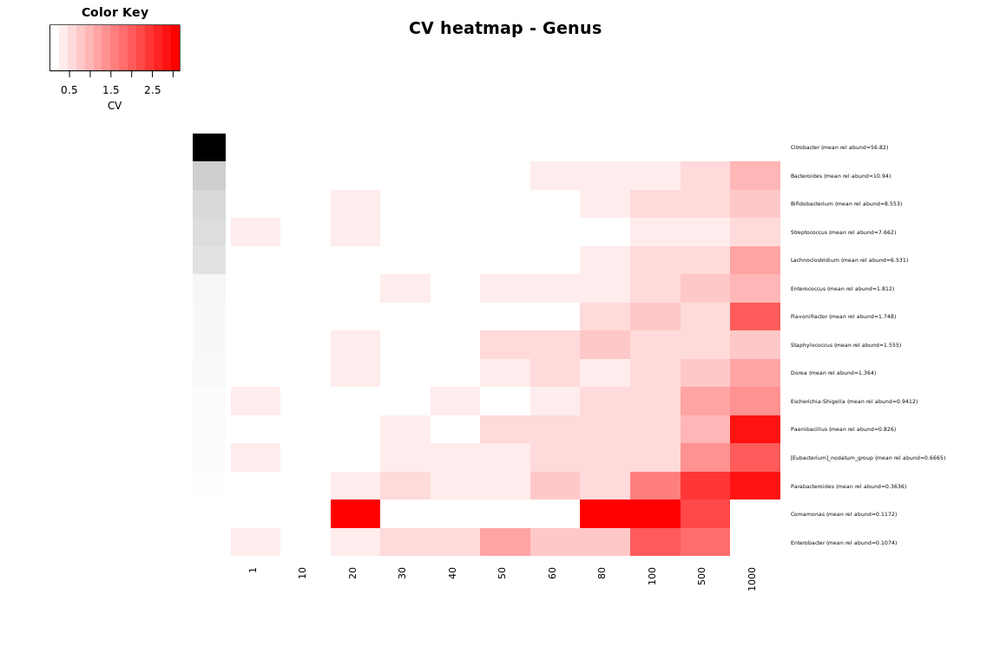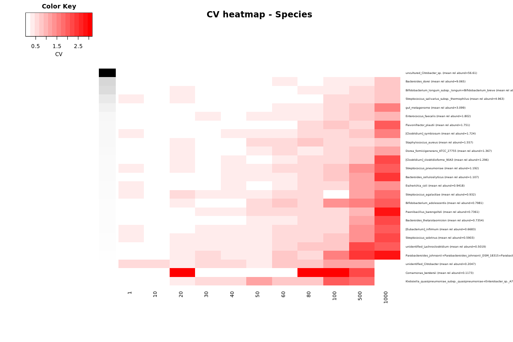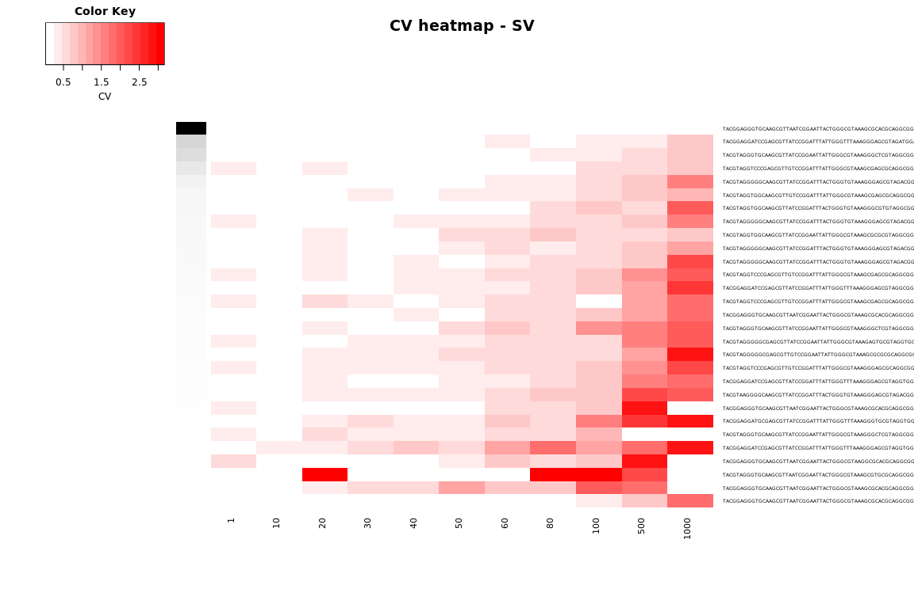

## Alpha diversity as a function of dilution constant
And finally, alpha diversity:

```r
mapping.sel <- as(sample_data(psmock.rarefied), "data.frame")
adiv <- estimate_richness(psmock.rarefied, measures=alpha_metrics)
adiv$SampleID <- rownames(adiv)
adiv <- merge(adiv, mapping.sel, by="row.names"); rownames(adiv) <- adiv$SampleID
for (mvar in c("DilutionFactor")) {
	plotlist <- list()
	for (alpha_metric in alpha_metrics) {
		if (nlevels(adiv[,mvar]) > 2) {
			test <- kruskal.test(as.formula(sprintf("%s ~ %s", alpha_metric, mvar)), adiv)
		}
		else {
			test <- wilcox.test(as.formula(sprintf("%s ~ %s", alpha_metric, mvar)), adiv)
		}
		p <- ggplot(adiv, aes_string(x=mvar, y=alpha_metric)) + geom_boxplot() + theme_classic() + ggtitle(sprintf("%s by %s (%s p=%.4g)", alpha_metric, mvar, test$method, test$p.value)) + theme(title=element_text(size=8))
		plotlist[[length(plotlist)+1]] <- p
	}
	multiplot(plotlist=plotlist, cols=2, rows=2)
}
```

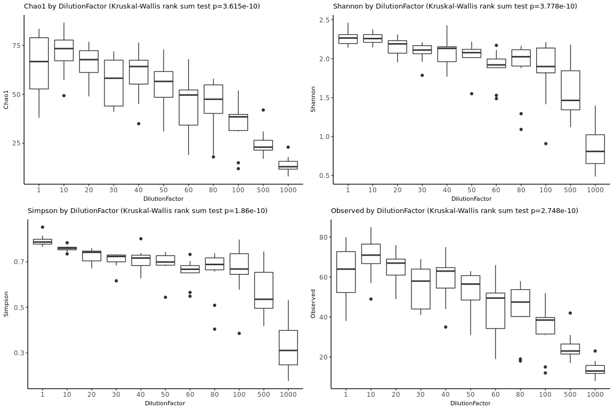

<br><br>
All in all, we see that variability seems to take off at the 1:80 or 1:100 dilution set. In other words, we may consider the 1:80 dilution set (~100 copies/uL) to be the lower limit of what can be robustly quantified.

Now, one caveat to all of this is that these dilution coefficients are only theoretically, although they match pretty well to the actual qPCR measurements. To really make these data generalizable, let's model variation (measured as standard deviation in relative abundances) as a function of 16S copies/uL from the qPCR and mean relative abundance from the microbiome data. Note that we'll log-transform all of the values to avoid negative outcomes as these don't make any sense.

## Variation as a function of 16S copy number and mean relative abundance (MRA)

```r
taxlevel <- "Genus"
mapping.sel <- as(sample_data(psmock.relative), "data.frame")
otu.filt <- as.data.frame(otu_table(psmock.relative))
otu.filt$tax <- getTaxonomy(otus=rownames(otu.filt), tax_tab=tax_table(psmock.relative), level=taxlevel)
agg <- aggregate(. ~ tax, otu.filt, sum)
agg <- subset(agg, !(tax %in% c("", "uncultured")))
tax <- agg$tax
agg <- agg[,-1]
rownames(agg) <- tax
agg <- agg[setdiff(1:nrow(agg), which(rowMeans(agg)<0.001)),] # dont test taxa with <0.1% mean rel. abund.
agg <- normalizeByCols(agg) * 100 # convert to percentages
df <- t(do.call(rbind, lapply(levels(mapping.sel$DilutionFactor), function(lvl) {
	tmp <- agg[,rownames(subset(mapping.sel, DilutionFactor==lvl))]
	apply(tmp, 1, function(x) sd(x))
})))
colnames(df) <- levels(mapping.sel$DilutionFactor)
mra <- sort(rowMeans(agg[rownames(df),]), decreasing=T)
df <- df[names(mra),]
df[which(df==0, arr.ind=T)] <- NA

df.mod <- melt(df); colnames(df.mod) <- c(taxlevel, "DilutionFactor", "SD_RelAbund")
df.mod$MeanRelAbund <- mra[as.character(df.mod[,taxlevel])]
df.mod$log10MRA <- log10(df.mod$MeanRelAbund)
df.mod$log10DilutionFactor <- log10(df.mod$DilutionFactor)
df.mod[, "log10CopiesPerUl"] <- qpcr.agg[match(df.mod$DilutionFactor, as.numeric(as.character(qpcr.agg$DilutionFactor))), "log10CopiesPerUl"]
df.mod$logSD_RelAbund <- log10(df.mod$SD_RelAbund)
for (v in c("log10CopiesPerUl", "log10MRA")) {
	test <- cor.test(as.formula(sprintf("~logSD_RelAbund + %s", v)), df.mod, method="spearman")
	p <- ggplot(df.mod, aes_string(x=v, y="logSD_RelAbund")) + geom_point() + stat_smooth(method="lm") + theme_classic() + ggtitle(sprintf("log10SD_RelAbund ~ %s (Spearman rho=%.4g p=%.4g", v, test$estimate, test$p.value))
	print(p)
}
```

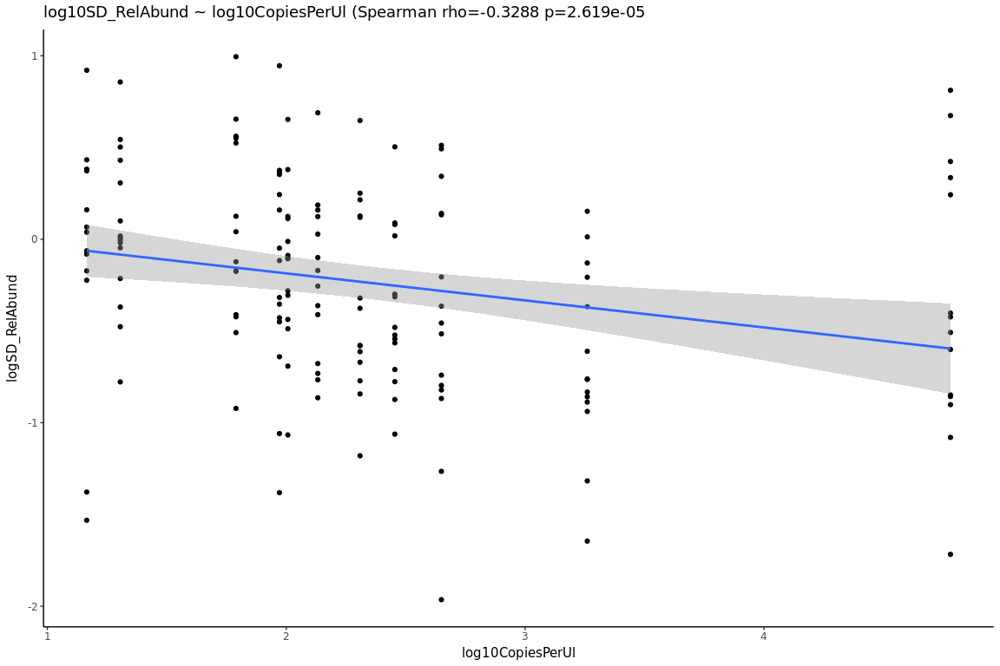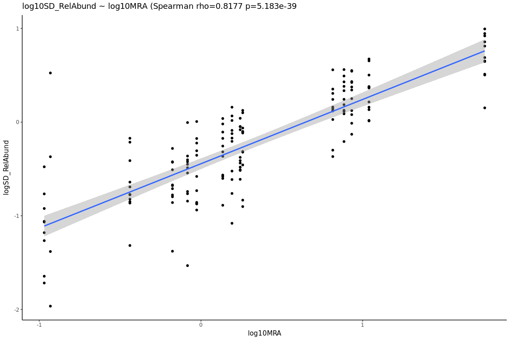

We can also use multivariate linear regression to model these relationships:

```r
	mod <- lm(logSD_RelAbund ~ log10CopiesPerUl + log10MRA, df.mod)
	summary(mod)
```

```
## 
## Call:
## lm(formula = logSD_RelAbund ~ log10CopiesPerUl + log10MRA, data = df.mod)
## 
## Residuals:
##     Min      1Q  Median      3Q     Max 
## -1.2075 -0.1556 -0.0066  0.1493  1.5263 
## 
## Coefficients:
##                  Estimate Std. Error t value Pr(>|t|)    
## (Intercept)      -0.09218    0.06554  -1.407    0.162    
## log10CopiesPerUl -0.15022    0.02562  -5.864 2.66e-08 ***
## log10MRA          0.68782    0.03512  19.587  < 2e-16 ***
## ---
## Signif. codes:  0 '***' 0.001 '**' 0.01 '*' 0.05 '.' 0.1 ' ' 1
## 
## Residual standard error: 0.3027 on 154 degrees of freedom
##   (8 observations deleted due to missingness)
## Multiple R-squared:  0.7302,	Adjusted R-squared:  0.7267 
## F-statistic: 208.4 on 2 and 154 DF,  p-value: < 2.2e-16
```

And then using the linear model to predict variation for some useful mean relative abundance values (1%, 5%, 10%, 25%, 50%), as well as low (10 copies/uL), medium (1000 copies/uL), and high (100000 copies/uL) biomass samples:

```r
paramgrid <- expand.grid(MRA=c(1, 5, 10, 25, 50), log10CopiesPerUl=c(1, 3, 5))
paramgrid$log10MRA <- log10(paramgrid$MRA)
paramgrid$predicted_logSD_RelAbund <- predict(mod, newdata=paramgrid)
paramgrid$predicted_SD_RelAbund <- 10^paramgrid$predicted_logSD_RelAbund
out <- dcast(paramgrid, log10CopiesPerUl ~ MRA, value.var="predicted_SD_RelAbund")
out
```

```
##   log10CopiesPerUl         1         5        10       25       50
## 1                1 0.5722617 1.7312653 2.7888140 5.237603 8.437009
## 2                3 0.2865192 0.8668077 1.3962998 2.622356 4.224231
## 3                5 0.1434541 0.4339922 0.6990976 1.312958 2.114983
```


